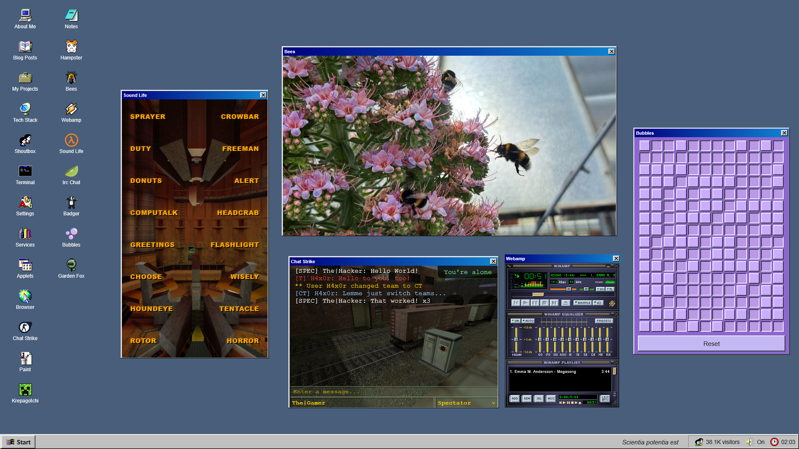

# Chat-Strike

## Table of contents

- [Description](#description)
- [Features](#features)
- [Commands](#commands)
- [Installation](#installation)
- [Available settings](#available-settings)
- [License](#license)

## Description

Chat-Strike is a simple retro chat-box that you can self-host and embed into a web project (using an iframe). Think of it as a live updated shoutbox that revives the nostalgic gaming times of the old Counter-Strike 1.6 days.



Note: This is not designed to be directly opened in your browser, but rather to be embedded into your own web project. It will adjust to your iframe / parent container elements in order to keep being responsive. The screenshot shows an example usage in one of my own web projects.

## Features

- Send text messages
- Send radio commands
- Send speech commands
- Send leetspeak text
- Switch teams (CT, T, SPEC)
- View online count
- Toggle sound
- Responsive design
- Basic docker setup

## Commands

The following commands are available

1. `/radio`
Issue a radio command. 
```shell
/radio gogogo
```

2. `/speak`
Issue a VOX speech command
```shell
/speak access denied
```

3. `/leet`
Send a chat message translated to leetspeak
```shell
/leet Owned by a pro-gamer.
```

4. `/switchbg`
Switch to a different background image (randomly selected)
```shell
/switchbg
```

5. `/sound`
Toggle sound or check sound status
```shell
/sound on|off|status
```

6. `/timestamps`
Toggle timestamps for chat or check timestamps status
```shell
/timestamps on|off|status
```

## Installation

The recommended way to install the project is using Docker.

**WARNING: Codeberg does not have a container registry, so you have to build the image yourself!**

1. Clone the repository
    ```bash
    git clone https://codeberg.org/danielbrendel/chat-strike.git
    ```

2. Edit your prefered settings in the `docker-compose.yml`

3. Copy related sound files to the directories `/public/snd` and `/public/snd/voice`.

4. Build the image
    ```bash
    docker buildx build . --platform linux/amd64 --tag danielbrendel/chat-strike:latest --load
    ```

    **Note:** Choose your platform depending on your environment:
    - linux/arm/v7
    - linux/arm64/v8
    - linux/amd64

5. Launch all containers
    ```bash
    docker compose up -d
    ```

    **Hint:** You can always change your settings in the `docker-compose.yml` and rerun step 5. You don't need to rebuild the image all the time.

6. Embed in your own web project using an iframe.
    ```html
    <iframe src="your-url-goes-here"></iframe>
    ```

## Available settings

This section covers all available app settings with default values.

| Setting  | Description | Default |
| ------------- | ------------- | ----- |
| APP_DELAY_FETCH  | Duration in milliseconds when to check for new chat content  | 10000 |
| APP_DELAY_ONLINE  | Duration in milliseconds when to check for amount of people online  | 10000 |
| APP_DEBUG  | Enable or disable app debug mode  | true |
| APP_UPDATEDEPS  | Set to true if composer packages shall be updated upon container start  | false |
| APP_TIMEZONE  | Set your prefered time zone  | UTC |
| LOG_ENABLE  | Whether app logging shall be enabled or not  | true |

## License

MIT. Please see [LICENSE.TXT](LICENSE.txt) for more information.