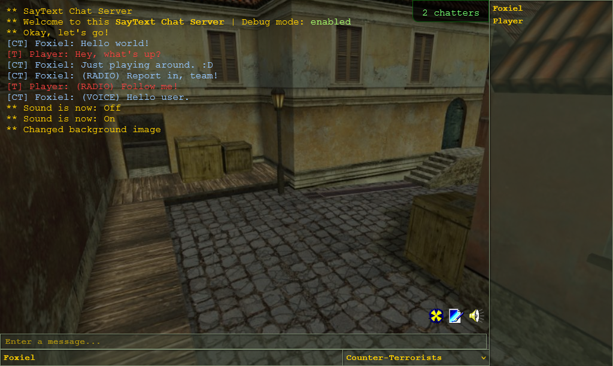

<h1 align="center">
    SayText Chat
</h1>

<p align="center">
    Chat like you're playing CS 1.6 again<br/>
    (C) 2026 by Daniel Brendel<br/>
    <a href="https://www.danielbrendel.com">www.danielbrendel.com</a>
</p>

<p align="center">
    
    
    
    
</p>

<p align="center">
    
</p>

## Table of contents

- [Description](#description)
- [Features](#features)
- [Commands](#commands)
- [Installation](#installation)
- [Available settings](#available-settings)
- [License](#license)
- [Disclaimer](#disclaimer)

## Description

SayText Chat is a simple self-hostable retro chat app that revives the feeling of playing oldschool CS 1.6. It works without logins, hence usernames are related to the clients' session token. If someone claimed a username, it will remain claimed until the last chat message by that user is cleared. To automatically clear message history, use the associated cronjob.

## Features

- Send text messages
- Send radio commands
- Send speech commands
- Send leetspeak text
- Switch teams (CT, T, SPEC)
- View online count
- View online users
- Toggle sound
- Switch backgrounds
- API endpoint
- Responsive design
- Basic docker setup

## Commands

The following commands are available

1. `/radio`
Issue a radio command. 
```shell
/radio gogogo
```

2. `/speak`
Issue a VOX speech command
```shell
/speak access denied
```

3. `/leet`
Send a chat message translated to leetspeak
```shell
/leet Owned by a pro-gamer.
```

4. `/switchbg`
Switch to a different background image (randomly selected)
```shell
/switchbg
```

5. `/sound`
Toggle sound or check sound status
```shell
/sound on|off|status
```

6. `/timestamps`
Toggle timestamps for chat or check timestamps status
```shell
/timestamps on|off|status
```

## Installation

The recommended way to install the project is using Docker.

1. Clone the repository
    ```bash
    git clone https://github.com/danielbrendel/saytext-chat
    ```

2. Edit your prefered settings in the `docker-compose.yml`

3. Pull the image
    ```bash
    docker compose pull
    ```

4. Launch all containers
    ```bash
    docker compose up -d
    ```

5. The app should now be available on [http://localhost:8080](http://localhost:8080).

You should also set up a cronjob that performs a request on the following endpoint in order to clear messages older than one day. It is suggested to execute this cronjob once per day.

```
POST /chat/clear
```

Furthermore, the following API endpoints are available

```
# Fetch server status information
ANY /api/status

# Check if a username is available
ANY /api/checkname
```

## Available settings

This section covers all available app settings with default values.

| Setting  | Description | Default |
| ------------- | ------------- | ----- |
| APP_SERVERNAME  | Set your prefered chat server name  | "SayText Chat Server" |
| APP_SERVERTOPIC  | Set your prefered chat server topic  | "Welcome to this SayText Chat server" |
| APP_SERVERPREVIEW | Set your prefered chat server preview image relative to /public/img folder | "preview.png" |
| APP_DELAY_FETCH  | Duration in milliseconds when to check for new chat content  | 10000 |
| APP_DELAY_ONLINE  | Duration in milliseconds when to check for amount of people online  | 10000 |
| APP_RESOURCEHOST  | Set the resource provider URL for docker deployment  | "https://resources.saytextchat.com" |
| APP_DEBUG  | Enable or disable app debug mode  | true |
| APP_UPDATEDEPS  | Set to true if composer packages shall be updated upon container start  | false |
| APP_TIMEZONE  | Set your prefered time zone  | UTC |
| LOG_ENABLE  | Whether app logging shall be enabled or not  | true |

## Available BBCodes

You can specify the following BBCodes for the server topic

| Name  | Description | Example |
| ------------- | ------------- | ----- |
| Bold | Make an expression appear bold  | [b]This text is bold[/b] |
| Italic | Make an expression appear italic  | [i]This text is italic[/i] |
| Underline | Make an expression appear underlined  | [u]This text is underlined[/u] |
| Strikethrough | Make an expression appear striked-through  | [s]This text is striked-through[/s] |
| Color (hex) | Colorize an expression using hex codes  | [color=#00f203]This text is colored[/color] |
| Color (RGB) | Colorize an expression using RGB values  | [color=rgb(100, 50, 230)]This text is colored[/color] |

## License

This project is maintained under the MIT license. Please see [LICENSE.TXT](LICENSE.txt) for more information.

## Disclaimer

This project is fan-made, and is not affiliated with Valve Corporation or any of their properties.
